# Admin Interface

Berikut adalah beberapa interface admin Website.

## Login

`https://indonesianbeautyblogger.com/cp`
`https://indonesianbeautyblogger.com/cp/auth/login`

Sama dengan interface login biasa, namun kadang muncul juga interface dari cms seperti berikut. Hanya user dengan **Admin Permission** yang bisa masuk ke CMS.

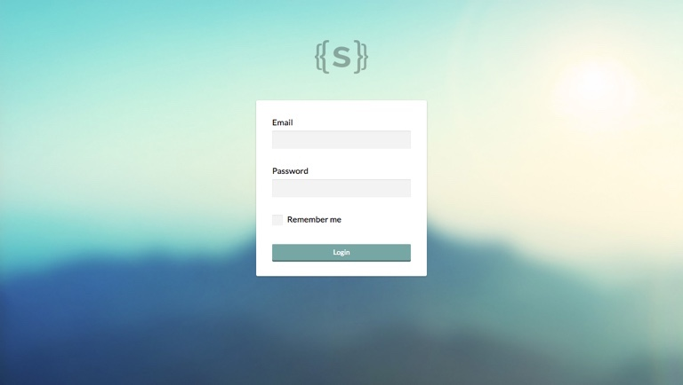

## Page

Ini mengatur semua halaman statis website. Yaitu halaman yang tidak ada unsur kategori/series/waktu.

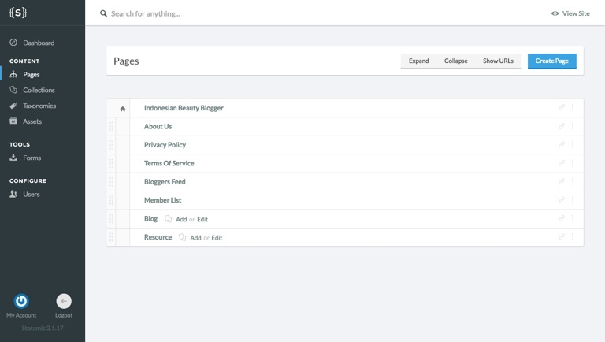

## Collections

Beda dengan Page. Ini merupakan tipe postingan yang dipengaruhi oleh kategori/series/waktu.

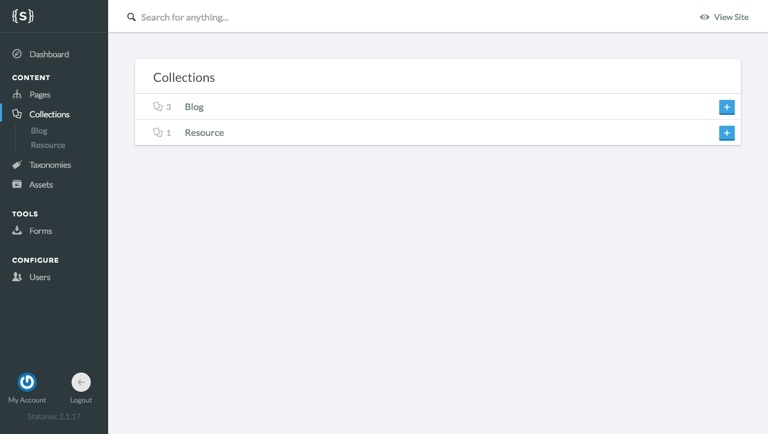

Ada 3 Jenis Collections di website ini, yaitu:

1. Blog
2. Resources
3. Review

### Blog

Blog berisi konten updates dengan kategori yang telah dibuat di taxonomy.

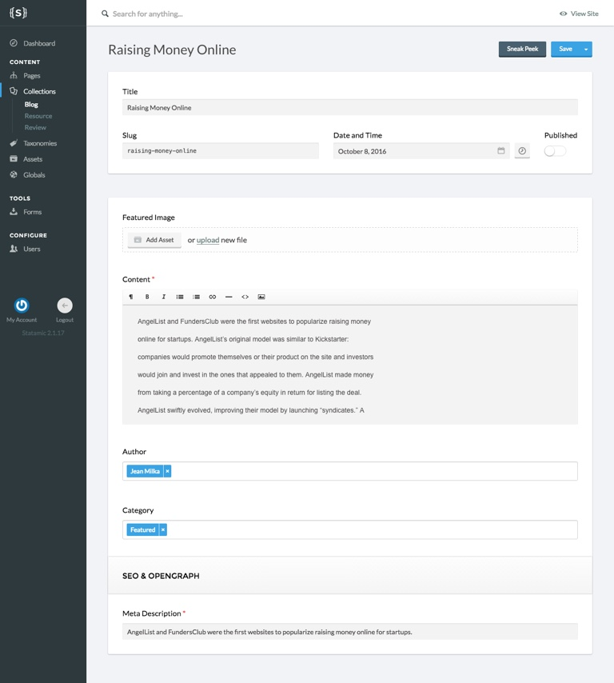

### Resources

Resources adalah blogging guide. Namun isinya hanyalah link yang menuju ke website lain. Jika ingin diarahkan ke website sendiri, buat blogpost yang nanti menjadi tujuan resource ini.

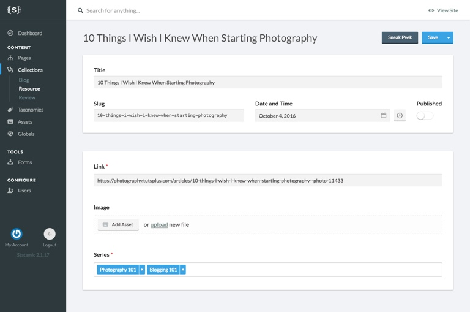

### Review

Sama seperti blog. Namun ada penambahan informasi produk dan rating produk.

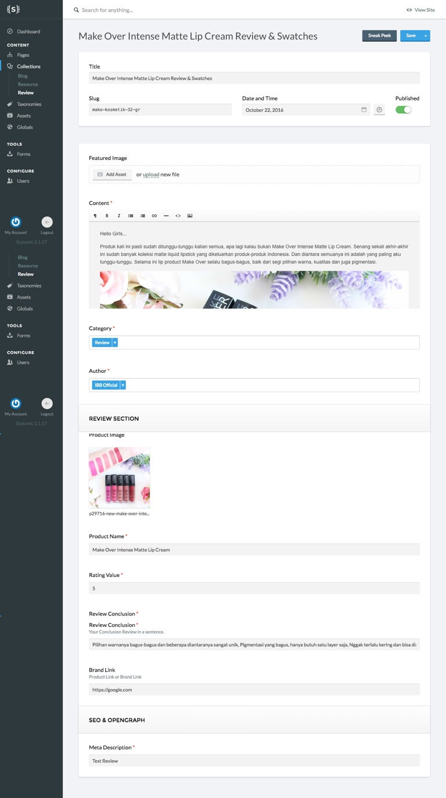

## Taxonomy

Taxonomy adalah dasar dari pengelompokan konten di website ini.

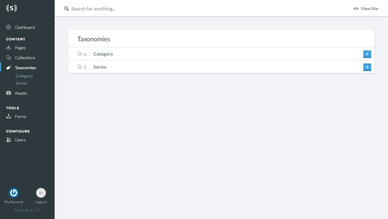

Terdapat 2 jenis taxonomy yaitu:

1. **Kategori**
2. **Series**

### Kategori

Postingan blog akan dikategorikan berdasarkan item yang telah dibuat di kategori ini.

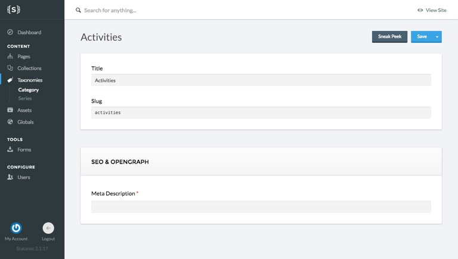

### Series

Series diperuntukkan buat resource. Agar link yang sudah dibuat tersusun rapi.

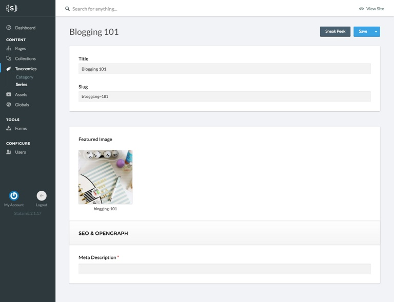

## Globals

Globals berisi nilai yang mengatur keseluruhan fungsional website.

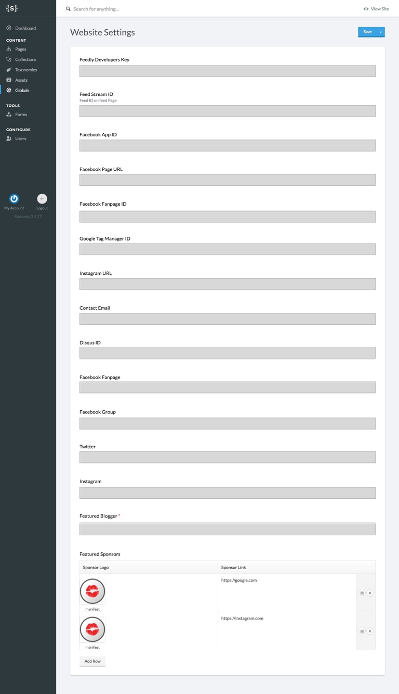

## Users

Berisi user yang telah terdaftar di website.

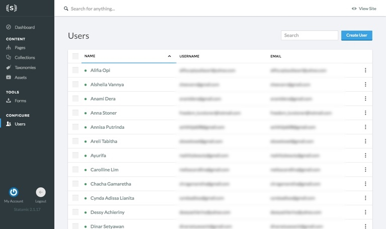

