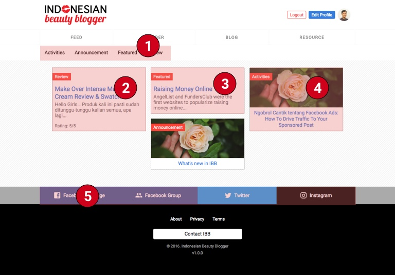

# Frontend Interface

Berikut adalah beberapa interface untuk frontend website. Yang dinomorin adalah
yang bisa dikontrol di bagian Admin.

## Homepage

`https://indonesianbeautyblogger.com`

1. **Featured Blogger** muncul jika member di settingan
`Global > Website > Featured Blogger` terpilih. Link *See Profile* menuju ke
halaman [Profil Member](#member-single)
2. **Featured Sponsors**, logo akan muncul jika ada gambar dipilih di settingan
`Global > Website > Featured Sponsors`
3. **Link Social Media**, ini akan muncul di setiap halaman. Diatur di settingan
`Global > Website`

## Blogger Feed

`https://indonesianbeautyblogger.com/feed`

Berisi 51 artikel kombinasi dari RSS Feed blogger-blogger terpilih menggunakan
service [Feedly](https://feedly.com).

1. **Blogger Feed** Masukkan kode `Stream` dari feedly di settingan
`Global > Website > Feed Stream ID`
2. **Link Social Media**, lihat [Homepage](#homepage)

## Member Page

`https://indonesianbeautyblogger.com/member`

Halaman ini akan melist semua member. Member dapat **difilter** based on
location dan **nama**.

1. **Nama dan Lokasi** dikontrol dari user sendiri. User wajib mengisi nama lengkap
di halaman registrasi
2. **Link Social Media**, lihat [Homepage](#homepage)

## Blog List Page

`https://indonesianbeautyblogger.com/blog` = Halaman 1
`https://indonesianbeautyblogger.com/blog?page=2` = Halaman 2, dst

Halaman ini berisi semua postingan blog/news dan review. Maksimal adalah 15
halaman, dan nanti akan muncul tombol next ketika data melebihi 15.

1. **List Kategori** akan bertambah secara otomatis jika terdapat sebuah
postingan dalam kategori tersebut.
2. **Review Post**, postingan khusus review di mana terdapat rating produk di
bawah (max 5).
3. **Postingan tanpa Featured Image**, label berwarna merah adalah kategori post
tersebut. Maksimal 1 kategori per post.
4. **Postingan dengan Featured Image**

## Resource Page

1. Featured Blogger
2. Sponsored Area
3. Link Social Media

## Static Page

1. Featured Blogger
2. Sponsored Area
3. Link Social Media

## Login

1. Featured Blogger
2. Sponsored Area
3. Link Social Media

## Register

1. Featured Blogger
2. Sponsored Area
3. Link Social Media

## Lupa Password

1. Featured Blogger
2. Sponsored Area
3. Link Social Media

