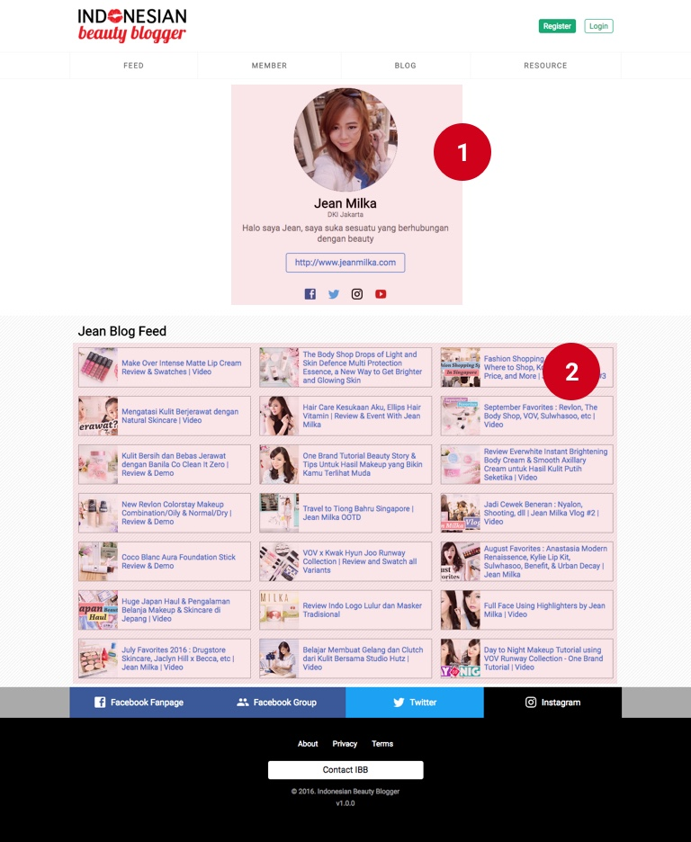

# Frontend Interface

Berikut adalah beberapa interface untuk frontend website. Yang dinomorin adalah
yang bisa dikontrol di bagian Admin.

## Homepage

`https://indonesianbeautyblogger.com`

1. **Featured Blogger** muncul jika member di settingan
`Global > Website > Featured Blogger` terpilih. Link *See Profile* menuju ke
halaman [Profil Member](#member-single)
2. **Featured Sponsors**, logo akan muncul jika ada gambar dipilih di settingan
`Global > Website > Featured Sponsors`
3. **Link Social Media**, ini akan muncul di setiap halaman. Diatur di settingan `Global > Website`

## Blogger Feed

`https://indonesianbeautyblogger.com/feed`

Berisi 51 artikel kombinasi dari RSS Feed blogger-blogger terpilih menggunakan
service [Feedly](https://feedly.com).

1. **Blogger Feed** Masukkan kode `Stream` dari feedly di settingan
`Global > Website > Feed Stream ID`
2. **Link Social Media**, lihat [Homepage](#homepage)

## Member Page

`https://indonesianbeautyblogger.com/member`

Halaman ini akan melist semua member. Member dapat **difilter** based on
location dan **nama**.

1. **Nama dan Lokasi** dikontrol dari user sendiri. User wajib mengisi nama lengkap di halaman registrasi
2. **Link Social Media**, lihat [Homepage](#homepage)

## Member Single Page

`https://indonesianbeautyblogger.com/member/{id}`

Halaman ini merupakan detail dari user yang datanya berasal dari halaman update profile.

1. **User Data** Data berasal dari halaman update profil.
2. **Blog Feed** Masukkan link blog feed seperti `https://{anything}.blogspot.co.id/rss.xml`

## Blog List Page

`https://indonesianbeautyblogger.com/blog` = Halaman 1
`https://indonesianbeautyblogger.com/blog?page=2` = Halaman 2, dst

Halaman ini berisi semua postingan blog/news dan review. Maksimal adalah 15
halaman, dan nanti akan muncul tombol next ketika data melebihi 15.

1. **List Kategori** akan bertambah secara otomatis jika terdapat sebuah
postingan dalam kategori tersebut.
2. **Review Post**, postingan khusus review di mana terdapat rating produk di
bawah (max 5).
3. **Postingan tanpa Featured Image**, label berwarna merah adalah kategori post tersebut. Maksimal 1 kategori per post.
4. **Postingan dengan Featured Image**
5. **Link Social Media**, lihat [Homepage](#homepage)

## Blog Single Page

`https://indonesianbeautyblogger.com/blog/{slug}`

Halaman artikel yang akan dibaca oleh pengunjung website.

1. **Meta Data**, diambil dari data **Featured Image**, **Kategori**, dan **Author**
2. **Judul & Publish Date**, diambil dari **Title** dan **Publish Date**.
3. **Konten**
4. **Komentar Disqus**. Settingan disqus diambil dari `Global > Website > Disqus ID`
5. **Slot Ads**, *Coming Soon*
6. **Link Social Media**, lihat [Homepage](#homepage)

## Review Single Page

`https://indonesianbeautyblogger.com/review/{slug}`

Halaman review ada tambahan review produk di bagian bawah

1. **Meta Data**, diambil dari data **Featured Image**, **Kategori**, dan **Author**
2. **Judul & Publish Date**, diambil dari **Title** dan **Publish Date**.
3. **Konten**
4. **Produk Review**. Data diambil dari **Product Image**, **Product Name**, **Rating**, dan **Conclusion**
5. **Slot Ads**, *Coming Soon*
6. **Link Social Media**, lihat [Homepage](#homepage)

## Resource List Page

`https://indonesianbeautyblogger.com/resource`

1. **Series**, akan muncul jika **series telah dibuat** dan **terdapat paling sedikit 1 resource dalam series tersebut**
2. **Link Social Media**, lihat [Homepage](#homepage)

## Series Page

`https://indonesianbeautyblogger.com/resource/{series}`

1. **Resource**. Diambil dari collection resource. Data yang dibutuhkan adalah **Featured Image** dan **Link**. Selalu open in new tab.
2. **Link Social Media**, lihat [Homepage](#homepage)

## Static Page

`https://indonesianbeautyblogger.com/about`
`https://indonesianbeautyblogger.com/privacy`
`https://indonesianbeautyblogger.com/terms`

1. **Konten**

## Login

`https://indonesianbeautyblogger.com/login`

## Register

`https://indonesianbeautyblogger.com/register`

## Lupa Password

`https://indonesianbeautyblogger.com/forget-password`

